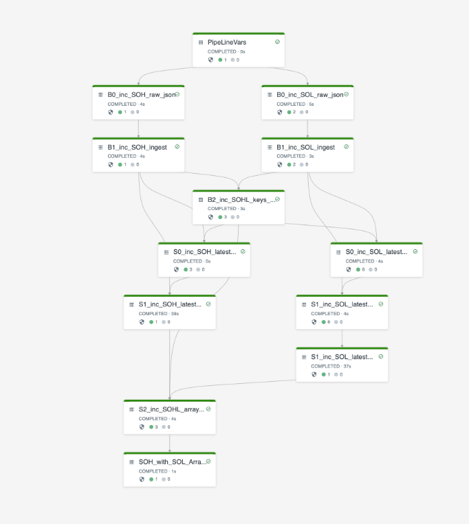

<p align="center">
Sales Order+Lines combined Pipeline<BR>
<BR>
DAG: Final Table is SOH + ARRAY(SOL) LATEST view after edits
</p>

A  purely learning exercise for a new Databricks feature called "Delta Live Tables" (DLT) which is currently under pre-release stage.

### Goal: 
Create a deliberately over complex Pipeline, which when run over 5 scenarios (detailed below), ingests and processes/transforms raw json Order+Lines data with the final materialised table `SOH_with_SOL_Array_latest` showing the "latest" view of an Order along with a STRUCT ARRAY of Order lines. This table can be queried as a single table to get ALL data for a SINGLE order.

### Pipeline details

Main PIPELINE Notebook is called : `POC_2_pipeline.iynb` with these observations notes:
* "Watermarked" All Incremental Data with a fixed value `unix_micros(current_timestamp())` referenced as `AppendWaterMark`.
* All Incremental DLT are partioned using a calculated extract of Order Number - this could easily be a DATE value.
* All DLT have `pipelines.autoOptimize.zOrderCols` optimisation on Order Number (small dataset so needs to be proven over large dataset)
* DLT cant deal with complex aggregations (eg DISTINCT) so until table `SOH_with_SOL_Array_latest` is calculated, Changes are reflected multiple times at intermediuate stages
            

For Pipeline config I have used these values but any values of own choosing are OK:
1. Target Location for saveing DLT data (`"storage": "/mnt/poc_pipeline_2"`)
2. Name of the Database to use for registering the Materialised DLT tables:  (`"target": "DLT_DB_POC_2"`)
3. Notebook to Create Scenario files per 5 scenario runs is: `POC_1_create_json_scenarios`
At end of each (sceanrio) pipeline run, results can be checked using Notbook SQL command:
`select * from DLT_DB_POC_2.SOH_with_SOL_Array_latest`
            
### Scenarios are detailed by json file with overall contents below
(see file: `POC_1_create_json_scenarios`)

Scenario 1, Occurred: 2021-12-01 
```
SOH_1.json: {"HID":"H1","HDATE":"2021-12-01","HCUST":"C1","HCUSTNAME":"Charlie"}           -- NEW HEADER SO:H1
SOL_1.json: {"HID":"H1","LID":"L1","LDATE":"2021-12-01","PROD":"P1","AMT":13}             -- NEW LINE L1 for SO:H1
            {"HID":"H1","LID":"L2","LDATE":"2021-12-01","PROD":"P2","AMT":17}             -- NEW LINE L2 for SO:H1
```

Scenario 2, Occurred: 2021-12-02  
```
SOH_2.json: {"HID":"29H99","HDATE":"2021-12-02","HCUST":"C2","HCUSTNAME":"Bobby"}          -- NEW HEADER SO:29H99
SOL_2.json: {"HID":"H1","LID":"L3","LDATE":"2021-12-02","PROD":"P3","AMT":24}             -- NEW LINE for SO:H1
            {"HID":"H1","LID":"L2","LDATE":"2021-12-02","PROD":"P2","AMT":25}             -- AMEND Qty for L2 on SO:H1
```

Scenario 3, Occurred: 2021-12-03 
```
SOH_3.json:  "//"  -- ****BAD Data****- see Quality Constraints for this being skipped.   -- NO HEADERS
SOL_3.json:  {"HID":"29H99", "LID":"L4","LDATE":"2021-12-02","PROD":"P5","AMT":35}        -- NEW LATE Arriving LINE for SO:29H99
             {"HID":"3H3333","LID":"L5","LDATE":"2021-12-03","PROD":"P6","AMT":37}        -- New Line for SO:3H3333 (whose HEADER never received - but build default HEADER anyway)
```

Scenario 4, Occurred: 2021-12-04 
```
SOH_4.json:  <****Not Created****>                                                        -- NO SOH headers file received
SOL_4.json: {"HID":"29H99", "LID":"L6","LDATE":"2021-12-04","PROD":"P6","AMT":10}         -- NEW LINE L6 for SO:29H99
            {"HID":"29H99", "LID":"L4","LDATE":"2021-12-04","PROD":"P5","AMT":0 }         -- DELETE LINE L4 on SO:29H99 so will be flagged "IsLineDelete=True"
            {"HID":"3H3333","LID":"L5","LDATE":"2021-12-04","PROD":"P6","AMT":0 }         -- DELETE LINE L5 on SO:3H3333 (Header was never actually Received)  SOL will be flagged "IsLineDelete=True"  (**)
```

*Suspect that we need to say if all lines in SOL Array are "IsLineDelete=True"*
*then set SOH column "IsOrderDeleted=True" also. At moment it is not changed but Scenario 5 does mark SOH as Deleted*

Scenario 5, 2021-12-05
```
SOH_5.json: {"HID":"3H3333","HDATE":"2021-12-05","HCUST":"","HCUSTNAME":"Alfred"}       -- DELETE  Header 3H3333 (Marked as Delted)
SOL_5.json: <****Not Created****>                                                         -- NO SOL headers file received 
```
