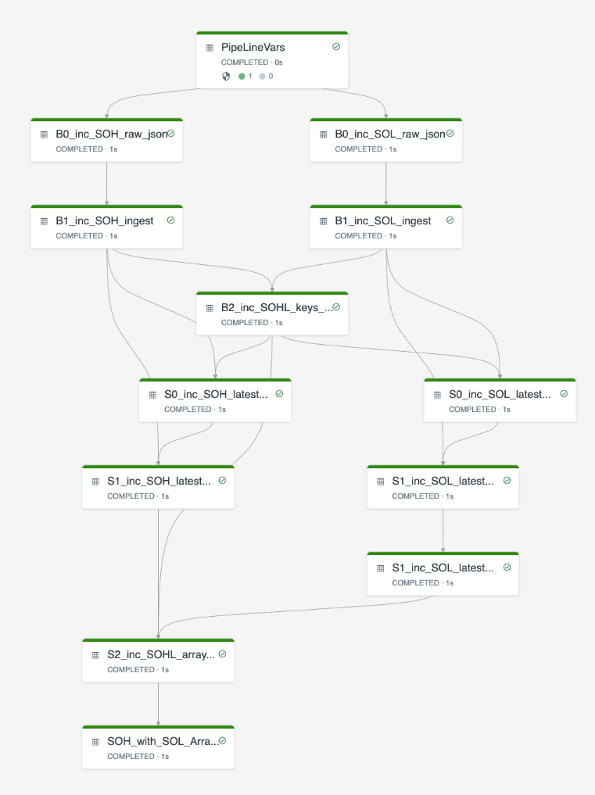

<p align="center">
Sales Order+Lines combined Pipeline<BR>
<BR>
DAG: Final Table is SOH + ARRAY(SOL) LATEST view after edits
</p>

A  purely learning exercise for a new Databricks feature called "Delta Live Tables" (DLT) which is currently under pre-release stage.

### Goal: 
Create a (deliberately over complex) Pipeline, which when run over 5 scenarios (detailed below), ingests and processes/transforms raw json Order+Lines data with the table `SOH_with_SOL_Array_latest` showing the "latest" view of an Order along with a STRUCT ARRAY of Order lines. 

The table row is self-healing in terms of header and line based data auto-rebuilds itself on any change so there is no need to "rebuild" whole table as a materialisation each time an update is received.
            
This table can be queried as a single table to get ALL data for a SINGLE order at once without joining to anything else.
            
To query a "previous" version of an order - one can use table `S2_inc_SOHL_array_unduped`.            

### Pipeline details

Main PIPELINE Notebook is called: `POC_2_pipeline.sql` with these observations notes:
* "Watermarked" All Incremental Data with a fixed value `unix_micros(current_timestamp())` referenced as `AppendWaterMark`.
* All Incremental DLT are partitioned using a calculated extract of Order Number - this could easily be a DATE value.
* All DLT have `pipelines.autoOptimize.zOrderCols` optimisation on Order Number (small dataset so needs to be proven over large dataset)
* DLT cant deal with complex aggregations (eg DISTINCT) so until table `SOH_with_SOL_Array_latest` is calculated, Changes are reflected multiple times at intermediate stages.
            

For Pipeline config I have used these values, but any values of own choosing are OK:
1. Target Location for saving DLT data (`"storage": "/mnt/poc_pipeline_2"`)
2. Name of the Database to use for registering the Materialised DLT tables:  (`"target": "DLT_DB_POC_2"`)
3. Notebook to Create Scenario files per 5 scenario runs is: `POC_1_create_json_scenarios.scala`
            
At end of each (scenario) pipeline run, results can be checked using Notebook SQL command:<BR>
`select * from DLT_DB_POC_2.SOH_with_SOL_Array_latest`
            
*See `POC_3_Queries.sql` for a more comprehensive list of check commands to review pipeline results for every stage*
            
            
### Scenarios are detailed by json file with overall contents below
(see file: `POC_1_create_json_scenarios.scala`)

Scenario 1, Occurred: 2021-12-01, Order:H1=Header+2 Order Lines L1,L2
```
SOH_1.json: {"HID":"H1","HDATE":"2021-12-01","HCUST":"C1","HCUSTNAME":"Charlie"}
SOL_1.json: {"HID":"H1","LID":"L1","LDATE":"2021-12-01","PROD":"P1","AMT":13}
            {"HID":"H1","LID":"L2","LDATE":"2021-12-01","PROD":"P2","AMT":17}
```

Scenario 2, Occurred: 2021-12-02,  Order:29H99 Header. Order:H1=Line L3, Line 2 Edit
```
SOH_2.json: {"HID":"29H99","HDATE":"2021-12-02","HCUST":"C2","HCUSTNAME":"Bobby"}
SOL_2.json: {"HID":"H1","LID":"L3","LDATE":"2021-12-02","PROD":"P3","AMT":24}
            {"HID":"H1","LID":"L2","LDATE":"2021-12-02","PROD":"P2","AMT":25}
```

Scenario 3, Occurred: 2021-12-03,  Order:29H99=Line L4 (Late), Order:3H3333=No Header, Line L5 (Early), BAD SOH file!
```
SOH_3.json:  "//"      ****BAD Data****- see Quality Constraints for this being skipped. 
SOL_3.json:  {"HID":"29H99", "LID":"L4","LDATE":"2021-12-02","PROD":"P5","AMT":35} 
             {"HID":"3H3333","LID":"L5","LDATE":"2021-12-03","PROD":"P6","AMT":37}
```

Scenario 4, 2021-12-04, Order:29H99= Add 1 Line, Delete 1 Line, Order:3H3333=Delete Order Line received yesterday
```
SOH_4.json:  <****Not Created****>   
SOL_4.json: {"HID":"29H99", "LID":"L6","LDATE":"2021-12-04","PROD":"P6","AMT":10}
            {"HID":"29H99", "LID":"L4","LDATE":"2021-12-04","PROD":"P5","AMT":0 }
            {"HID":"3H3333","LID":"L5","LDATE":"2021-12-04","PROD":"P6","AMT":0 }
```

*Suspect that we need to say if all lines in SOL Array are "IsLineDelete=True"*
*then set SOH column "IsOrderDeleted=True" also. At moment it is not changed but Scenario 5 does mark SOH as Deleted*

Scenario 5, 2021-12-05, Order:3H3333  Deleted
```
SOH_5.json: {"HID":"3H3333","HDATE":"2021-12-05","HCUST":"","HCUSTNAME":"Alfred"} 
SOL_5.json: <****Not Created****>   
```
